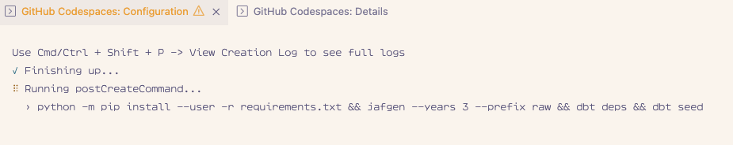

# 🥪 The DAAP Payroll 🦘
[](https://codespaces.new/dbt-labs/jaffle-shop-template?quickstart=1)
[](https://gitpod.io/#https://github.com/dbt-labs/jaffle-shop-template)

This is a template for creating a fully functional dbt project for teaching, learning, writing, demoing, or any other scenarios where you need a basic project with a synthesized payroll data for a business. We recommend beginners use the following steps to open this project right here on GitHub in a Codespace. If you're a little more experienced with devcontainers and want to go faster 🏎️, you can use the Gitpod link above for a quicker startup and deeper feature set.

## How to use

### 1. Click the big green 'Use this template' button and 'Create a new repository'.


This will create a new repository exactly like this one, and navigate you there. Make sure to execute the next instructions in that repo.

### 2. Click 'Code', then 'Codespaces, then 'Create codespace on main'.


This will create a new `codespace`, a sandboxed devcontainer with everything you need for a dbt project. Once the codespace is finished setting up, you'll be ready to run a `dbt build`.

### 3. Make sure to wait til the codespace is finished setting up.



After the container is built and connected to, VSCode will run a few clean up commands and then a `postCreateCommand`, a set of commands run after the container is set up. This is where we install our dependencies, such as dbt, the duckdb adapter, and other necessities, as well as run `dbt deps` to install the dbt packages we want to use. That screen will look something like the above. When it's completed it will close and leave you in a fresh terminal prompt. From there you're ready to do some analytics engineering!

## Local development

This project is optimized for running in a container. If you'd like to use it locally outside of container you'll need to follow the instructions below.

1. Create a python virtual environment and install the dependencies.

```console
python3 -m venv .venv
source .venv/bin/activate
pip install -r requirements.txt
```

2. Install meltano with [pipx](https://pypa.github.io/pipx/installation/). And install meltano's dependencies.

```console
pipx install meltano
meltano install
```

3. Run the EL pipeline.

```console
meltano run el
```

4. Install dbt dependencies and build the dbt project.

```console
dbt deps
dbt build
```


5. Install Evidence dependencies and run the Evidence server.

```console
cd reports
npm install
npm run dev
```

## Contributing

We welcome issues and PRs requesting or adding new features. The package that generates the synthetic data, [`jafgen`](https://pypi.org/project/jafgen/), is also under active development, and will add more types of source data to model as we go along. If you have tests, descriptions, new models, metrics, materializations types, or techniques you use this repo to demonstrate, which you feel would make for a more expansive baseline experience, we encourage you to consider contributing them back in so that this project becomes an even better collective tool for exploring and learning dbt over time.
